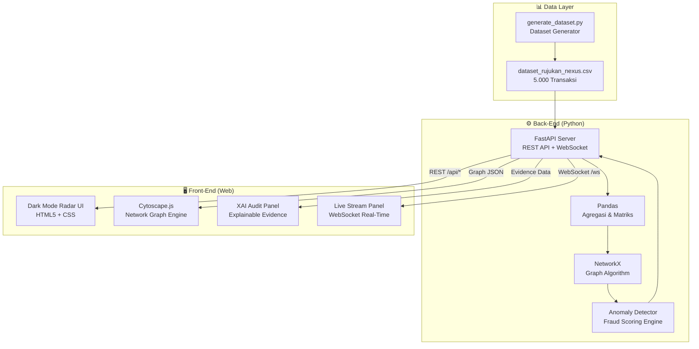

# 🛰️ NEXUS-JKN — Development Workflow & Implementation Roadmap

## Konteks Proyek

**NEXUS-JKN** (*Network Explorer & Unusual Syndicate-detector*) adalah sistem Radar Intelijen berbasis Graph Analytics & Visualisasi Real-Time untuk mendeteksi sindikat rujukan semu (*Self-Referral*) dan kolusi terstruktur antar-Fasilitas Kesehatan dalam Program JKN BPJS Kesehatan.

**Tujuan Kompetisi:** Healthkathon 2026 BPJS Kesehatan — Kategori AI/Innovation System.

**Keunggulan Proposal:** Menggunakan pendekatan **Graph Network** (bukan tabular biasa), menargetkan **Subkategori 10 (Self-Referral)** & **Subkategori 3 (Rujukan Tidak Sesuai)** — area yang belum disentuh pemenang edisi sebelumnya (PRO-CLAIM, Fraudbender, DiagnoSmart AI semuanya fokus tabular/transaksional).

---

## Arsitektur Sistem



---

## Workflow Pembangunan — 5 Sprint

> [!IMPORTANT]
> Workflow ini dirancang agar setiap sprint menghasilkan **deliverable yang bisa di-demo**. Jika waktu terbatas, Sprint 1-3 sudah cukup menjadi PoC yang solid untuk proposal.

---

### 🏁 SPRINT 0 — Foundation & Project Setup
**Estimasi:** ~30 menit | **Prioritas:** 🔴 KRITIS

| # | Task | Detail | Output |
|---|------|--------|--------|
| 0.1 | Setup project structure | Buat folder structure: `backend/`, `frontend/`, `data/` | Folder terstruktur |
| 0.2 | Inisialisasi Backend | `pip install fastapi uvicorn pandas networkx websockets python-multipart` | `requirements.txt` |
| 0.3 | Pindahkan data asset | Copy CSV ke `data/`, generator ke `scripts/` | Data terpusat |
| 0.4 | Git init | Inisialisasi repo, `.gitignore` | Version control aktif |

**Struktur folder target:**
```
healthkathon/
├── backend/
│   ├── main.py              # FastAPI entry point
│   ├── services/
│   │   ├── graph_engine.py   # NetworkX graph builder
│   │   ├── anomaly_detector.py # Fraud scoring algorithm
│   │   └── data_loader.py    # CSV ingestion & preprocessing
│   ├── models/
│   │   └── schemas.py        # Pydantic response models
│   ├── routers/
│   │   ├── analytics.py      # REST API routes
│   │   └── websocket.py      # WebSocket live stream
│   └── requirements.txt
├── frontend/
│   ├── index.html            # Main dashboard SPA
│   ├── css/
│   │   └── nexus.css         # Dark mode radar theme
│   ├── js/
│   │   ├── app.js            # Main application controller
│   │   ├── graph.js          # Cytoscape.js graph renderer
│   │   ├── audit-panel.js    # XAI side panel logic
│   │   └── live-stream.js    # WebSocket live feed
│   └── assets/
│       └── logo.svg
├── data/
│   └── dataset_rujukan_nexus.csv
├── scripts/
│   └── generate_dataset.py
└── README.md
```

---

### 🔧 SPRINT 1 — Back-End Core: Data Ingestion + Graph Engine
**Estimasi:** ~2-3 jam | **Prioritas:** 🔴 KRITIS

| # | Task | Detail | Output |
|---|------|--------|--------|
| 1.1 | **`data_loader.py`** | Load CSV, preprocessing, validasi kolom, generate summary statistics | Fungsi `load_dataset()` → DataFrame |
| 1.2 | **`graph_engine.py`** | Bangun Graph pakai NetworkX: Nodes = Faskes, Edges = Rujukan. Hitung **edge weight** (volume), **node degree**, **betweenness centrality** | Fungsi `build_referral_graph()` → NetworkX Graph |
| 1.3 | **`anomaly_detector.py`** | Implementasi fraud scoring berdasarkan 4 parameter: (1) Konsentrasi Rujukan, (2) Rasio ICD-10 Ringan, (3) Jarak Anomali, (4) Volume Berlebih | Fungsi `detect_anomalies()` → List[AnomalyResult] |
| 1.4 | **`schemas.py`** | Pydantic models: `NodeData`, `EdgeData`, `GraphResponse`, `AnomalyAlert`, `AuditEvidence` | Type-safe API contracts |
| 1.5 | **`main.py` + routers** | FastAPI app dengan endpoints, CORS middleware, static file serving | Server berjalan di `localhost:8000` |

**API Endpoints yang dibangun:**

```
GET  /api/graph          → Graph data (nodes + edges + weights) untuk Cytoscape.js
GET  /api/anomalies      → Daftar anomali terdeteksi dengan fraud score
GET  /api/audit/{edge}   → Detail evidence XAI untuk pasangan faskes tertentu
GET  /api/stats          → Summary statistics dashboard
POST /api/upload         → Upload CSV baru (opsional)
WS   /ws/live-stream     → WebSocket feed simulasi transaksi real-time
```

**Algoritma Deteksi Anomali — Detail Logika:**

```python
# Pseudo-code Fraud Scoring
fraud_score = (
    w1 * concentration_ratio    # Berapa % rujukan FKTP X ke RS Y (threshold: >50%)
  + w2 * mild_diagnosis_ratio   # Rasio diagnosis ringan (J00,A09) dalam edge (threshold: >60%)
  + w3 * distance_anomaly       # Rata-rata jarak > median jarak seluruh edge
  + w4 * volume_spike           # Volume edge > 2x standar deviasi dari rata-rata
)
# Jika fraud_score > threshold → Flag sebagai "MERAH" (high risk)
```

> [!TIP]
> Gunakan weighted sum sederhana dulu, bukan ML model. Ini lebih **explainable** (sesuai fitur XAI) dan lebih mudah di-demo ke juri. Juri Healthkathon lebih menghargai kejelasan logika daripada black-box ML.

---

### 🖥️ SPRINT 2 — Front-End: Dark Mode Radar Dashboard + Cytoscape.js Graph
**Estimasi:** ~3-4 jam | **Prioritas:** 🔴 KRITIS

| # | Task | Detail | Output |
|---|------|--------|--------|
| 2.1 | **`index.html`** | Layout SPA: Header, Graph Canvas (tengah), Stats Cards (atas), Audit Panel (kanan) | Skeleton HTML |
| 2.2 | **`nexus.css`** | Dark mode theme dengan nuansa **radar/cyber**: background gelap (#0a0e1a), aksen hijau neon (#00ff88), garis grid, glow effects | Premium dark UI |
| 2.3 | **`graph.js`** — Cytoscape.js | Render network graph: Nodes = faskes (warna beda FKTP vs FKRTL), Edges = garis rujukan. **Edge merah pulsing** untuk anomali. Zoom, pan, click events | Interactive graph |
| 2.4 | **`app.js`** | Fetch data dari API, orchestrate komponen, handle state | Application controller |
| 2.5 | **Stats Cards** | 4 kartu ringkasan: Total Transaksi, Total Anomali, Fraud Rate %, Faskes Terindikasi | Top dashboard strip |

**Spesifikasi Visual Graph:**

| Elemen | Normal | Anomali / Fraud |
|--------|--------|-----------------|
| **Node FKTP** | Lingkaran biru (#4a9eff), ukuran proporsional volume | Lingkaran oranye berkedip (#ff6b35) |
| **Node FKRTL** | Segi enam hijau (#00ff88) | Segi enam merah berkedip (#ff0040) |
| **Edge** | Garis abu tipis, opacity 30% | Garis **merah tebal**, **animasi pulsing** glow |
| **Label** | Nama faskes (font kecil) | Nama faskes + ⚠️ badge |

---

### 🔍 SPRINT 3 — XAI Audit Panel (Explainable AI Evidence)
**Estimasi:** ~2 jam | **Prioritas:** 🟡 PENTING

| # | Task | Detail | Output |
|---|------|--------|--------|
| 3.1 | **`audit-panel.js`** | Side panel slide-in saat user klik edge merah di graph | Panel interaktif |
| 3.2 | **Evidence Cards** | Tampilkan 4 kartu bukti: Konsentrasi %, Rasio Diagnosis, Jarak Rata-rata, Volume Transaksi | Bukti visual |
| 3.3 | **Narasi XAI** | Generate kalimat penjelasan otomatis, contoh: *"Deteksi Kolusi: 77.4% rujukan Klinik Pratama Sehat Sejahtera diarahkan ke RS Mitra Mulia, dengan 95.4% kasus berdiagnosis J00 pada jarak rata-rata 18.12 km"* | Human-readable explanation |
| 3.4 | **Detail Transaksi** | Tabel scroll daftar transaksi terkait edge yang diklik (id_rujukan, id_pasien, timestamp, dll) | Drill-down table |
| 3.5 | **Tombol Aksi Auditor** | Tombol "🔒 Kunci Faskes" dan "📋 Export Laporan" (simulasi) | CTA buttons |

> [!NOTE]
> Panel XAI inilah yang menjadi **pembeda utama** dari kompetitor. Juri akan langsung melihat bahwa sistem ini bukan hanya mendeteksi, tapi juga **menjelaskan mengapa** sebuah relasi dicurigai — sesuatu yang tidak dimiliki PRO-CLAIM atau Fraudbender.

---

### 📡 SPRINT 4 — Live Streaming Simulation (WebSocket)
**Estimasi:** ~1-2 jam | **Prioritas:** 🟢 BONUS (Efek WOW untuk demo juri)

| # | Task | Detail | Output |
|---|------|--------|--------|
| 4.1 | **WebSocket server** | Endpoint `/ws/live-stream` di FastAPI, baca CSV baris per baris dengan delay (simulasi real-time) | Server WS |
| 4.2 | **`live-stream.js`** | Panel bawah dashboard: ticker transaksi masuk real-time, highlight merah jika transaksi fraud | Live feed UI |
| 4.3 | **Graph update live** | Setiap transaksi masuk, edge di graph berkedip/bertambah tebal secara dinamis | Animated graph |
| 4.4 | **Counter animasi** | Angka di stats cards ikut naik secara real-time saat data streaming | Counting animation |
| 4.5 | **Kontrol playback** | Tombol ▶️ Play, ⏸️ Pause, ⏩ Speed (1x, 5x, 10x) | Transport controls |

> [!TIP]
> Sprint ini opsional tapi **sangat berdampak** saat demo di depan juri. Efek data streaming masuk satu per satu ke radar graph akan memberikan kesan **"sistem hidup"** yang sangat kuat.

---

## Prioritas Pengerjaan

```mermaid
gantt
    title NEXUS-JKN Development Timeline
    dateFormat  HH:mm
    axisFormat  %H:%M

    section Foundation
    Sprint 0 - Project Setup              :s0, 00:00, 30m

    section Core
    Sprint 1 - Backend Graph Engine        :s1, after s0, 3h
    Sprint 2 - Frontend Dashboard + Graph  :s2, after s1, 4h

    section Polish
    Sprint 3 - XAI Audit Panel             :s3, after s2, 2h
    Sprint 4 - Live Stream (Bonus)         :s4, after s3, 2h
```



---

## Checklist Kesiapan Demo

| # | Kriteria | Target |
|---|----------|--------|
| ✅ | Dataset 5.000 baris sudah di-generate | **DONE** — [dataset_rujukan_nexus.csv](file:///d:/healthkathon/dataset_rujukan_nexus.csv) |
| ⬜ | Backend API berjalan & return graph data | Sprint 1 |
| ⬜ | Graph network tampil interaktif di browser | Sprint 2 |
| ⬜ | Klik edge merah → muncul XAI evidence panel | Sprint 3 |
| ⬜ | Live streaming transaksi real-time (bonus WOW) | Sprint 4 |
| ⬜ | Screenshot/screen recording untuk proposal | Post-build |

---

## Open Questions

> [!IMPORTANT]
> **Pertanyaan sebelum mulai build:**
>
> 1. **Mau langsung mulai build dari Sprint 0?** Saya bisa langsung setup project structure + scaffold semua file sekaligus.
> 2. **Apakah ini untuk presentasi live demo atau hanya PDF proposal + screenshot?** Jika live demo, Sprint 4 (Live Stream) jadi prioritas tinggi. Jika PDF saja, cukup Sprint 1-3 lalu screenshot.
> 3. **Preferensi CSS framework**: Proposal menyebut Tailwind CSS / Bootstrap 5. Mau pakai yang mana, atau **Vanilla CSS** saja agar lebih ringan & cepat?
> 4. **Deadline kapan?** Pendaftaran sampai 14 September 2026 — apakah ada deadline internal tim yang lebih awal?

---

## Catatan Strategis dari Analisis Kompetitor

Berdasarkan [daftar pemenang](file:///d:/healthkathon/dokumen/daftar_pemenang_healthkathon.txt) Healthkathon 2019-2025:

| Pola Pemenang | Insight |
|---------------|---------|
| **Tidak ada yang pakai Graph Analytics** | NEXUS-JKN punya **first-mover advantage** di pendekatan ini |
| **PRO-CLAIM (Juara 3, 2025)** fokus validasi klaim tabular | NEXUS-JKN lebih advanced karena melihat **relasi antar-faskes** |
| **Fraudbender (Juara 3, 2024)** fokus klaim fiktif | NEXUS-JKN menargetkan **sindikat kolusi** — level lebih tinggi |
| **Juara 1 selalu punya WOW factor** (AIRA, IoT Wearable, dll) | Live streaming + radar graph = **efek WOW** NEXUS-JKN |
| **Juara yang baik punya narasi kuat** | XAI Panel memberikan **storytelling** yang meyakinkan juri |
